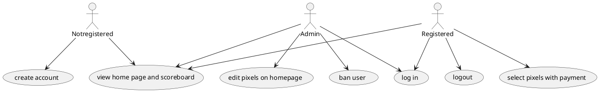
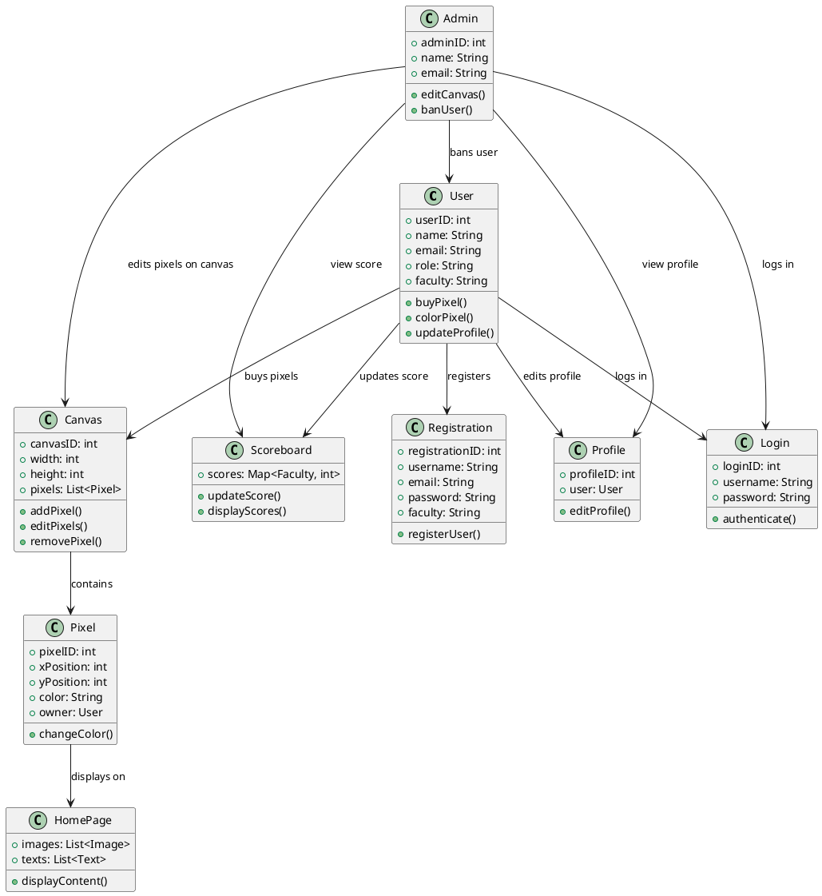
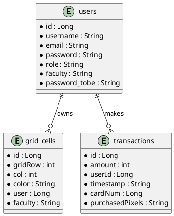
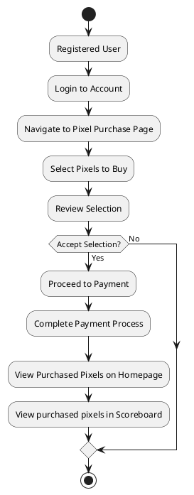
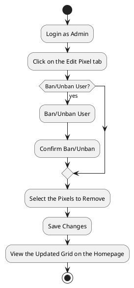
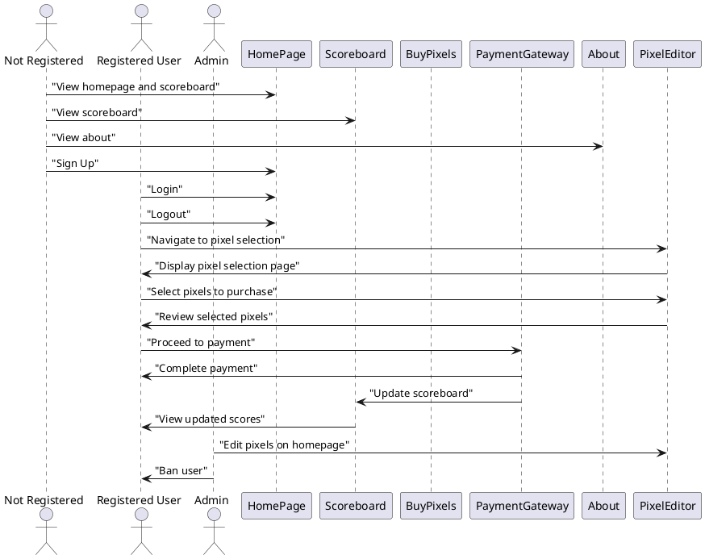
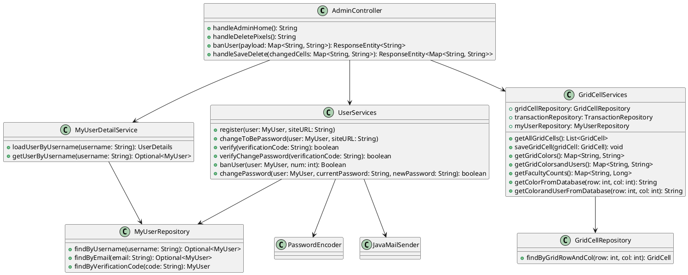
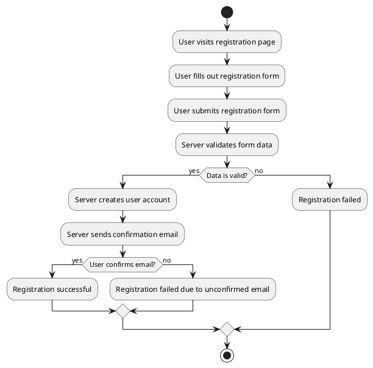

# VŠE page

Webová stránka s omezeným množstvím pixelů, které si lidé mohou koupit za symbolickou cenu 1 pixel za 1 korunu. Koupené pixely je možné zabarvit a vytvářet obrázky nebo slova, která se budou zobrazovat na domovské stránce. Stránka je zaměřena na studenty VŠE, ale nebrání se ani propagaci firem. Pixely si ale každý kupuje pouze na omezenou dobu. Po skončení období, jsou vybrané peníze odevzdány studentům z fakulty, která měla nejvíce pixelů. Aktuální skóre je možné sledovat na leaderboardu.

## Funkcionalita

Lidé si mohou vytvořit uživatelský profil, který je spojen a ověřen se školní emailovou adresou a fakultou VŠE.

Registrovaní uživatelé mohou kopit množství pixelů a libovolně je zbarvit, ale pouze na omezenou dobu.

Všichni uživatelé mohou sledovat scoreboard, který zobrazuje, která fakulta aktuálně nakoupila nejvíce pixelů v daném období. Dále mohou sledovat obrázek na homepage.

Moderátoři mají možnost mazat obsah nesplňující stanovené podmínky.

- návrhu úložiště
  - MySQL databáze na AWS, databáze se generuje podle dat v Entity balíčku, obsahuje tabulku uživatelů, pixelů a transakcí. S databází komunikujeme pomocí Repositories.

### Diagram případů užití

## Prototyp aplikace

https://www.figma.com/design/w4Fb3M0apUJyaB2PwkqFKG/Untitled?node-id=0-1&t=ok4inraVwJVVuUuQ-1

